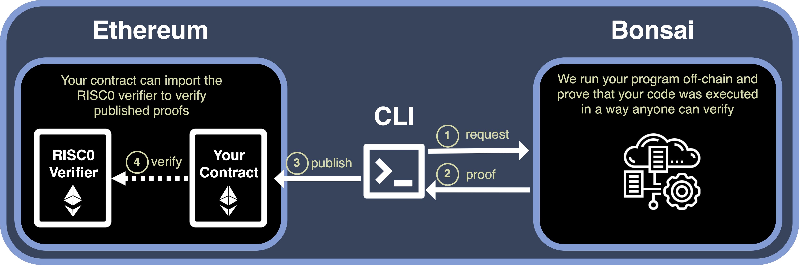

# Bonsai Foundry Template

> **Note: This software is not production ready. Do not use in production.**

Starter template for writing an application using [Bonsai].

This repository implements an application on Ethereum utilizing Bonsai as a [coprocessor] to the smart contract application.
It provides a starting point for building powerful new applications on Ethereum that offload computationally intensive, or difficult to implement, tasks to be proven by the [RISC Zero zkVM], with verifiable results sent to your Ethereum contract.

## Overview

The picture below shows a simplified overview of how users can integrate Bonsai into their Ethereum smart contracts:



1. Delegate your smart contract's logic to Bonsai. Use a Command Line Interface (`CLI`) to initiate an off-chain proof request, which is sent to Bonsai.
2. Bonsai generates a Snark proof and its result, encapsulated in a journal.
3. The `CLI` submits this proof and journal on-chain to `Your Contract` for validation.
4. `Your Contract` calls the `RISC0 Verifier` to validate the proof. If the verification is successful, the journal is deemed trustworthy and can be safely used.

## Dependencies
First, [install Rust] and [Foundry], and then restart your terminal. Next, you will need to install the `cargo risczero` tool.
We'll use `cargo binstall` to get `cargo-risczero` installed. See [cargo-binstall] for more details.

```bash
cargo install cargo-binstall
cargo binstall cargo-risczero
```

Next we'll need to install the `risc0` toolchain with:

```
cargo risczero install
```

## Quick Start
First, install the RISC Zero toolchain using the instructions above.

Now, you can initialize a new Bonsai project at a location of your choosing:

```bash
forge init -t risc0/bonsai-foundry-template ./my-project
```
Congratulations! You've just built your first Bonsai project.
Your new project consists of:
- a [`zkVM program`] (written in Rust), which specifies a computation that will be proven;
- a [`contract`] (written in Solidity), which receives the response;
- an [`interface`] (written in Rust), which lets you define how to parse input and output so that your contract can interact with Bonsai. 


[install Rust]: https://doc.rust-lang.org/cargo/getting-started/installation.html
[Foundry]: https://getfoundry.sh/
[cargo-binstall]: https://github.com/cargo-bins/cargo-binstall#cargo-binaryinstall
[`zkVM program`]: https://github.com/risc0/bonsai-foundry-template/tree/main/methods/guest/src/bin
[`contract`]: https://github.com/risc0/bonsai-foundry-template/tree/main/contracts
[`interface`]: https://github.com/risc0/bonsai-foundry-template/tree/main/cli/src/interface.rs

### Test Your Project
- Use `cargo build` to test compilation of your zkVM program.
- Use `cargo test` to run the tests in your zkVM program.
- Use `RISC0_DEV_MODE=false forge test -vvv` to test your Solidity contracts and their interaction with your zkVM program.

### Configuring Bonsai
***Note:*** *The Bonsai proving service is still in early Alpha. To request an API key [complete the form here](https://bonsai.xyz/apply).*

With the Bonsai proving service, you can produce a [Groth16 SNARK proof] that is verifiable on-chain.
You can get started by setting the following environment variables with your API key and associated URL.

```bash
export BONSAI_API_KEY="YOUR_API_KEY" # see form linked above
export BONSAI_API_URL="BONSAI_URL" # provided with your api key
```

Now if you run `forge test` with `RISC0_DEV_MODE=false`, the test will run as before, but will additionally use the fully verifying `RiscZeroGroth16Verifier` contract instead of `RiscZeroGroth16VerifierTest` and will request a SNARK receipt from Bonsai.

```bash
RISC0_DEV_MODE=false forge test -vvv
```

## Next Steps
To build your application, you'll need to make changes in three folders:
- write the code you want proven in the [methods] folder
- write the on-chain part of your project in the [contracts] folder
- write the Rust interface of your contract in the [cli] folder

Then, you're ready to [deploy your project]. <br/>


## Project Structure

Below are the primary files in the project directory

```text
.
├── Cargo.toml                      // Definitions for cargo and rust
├── foundry.toml                    // Definitions for foundry
├── cli                             // CLI for interacting with your application
│    ├── Cargo.toml
│    └── src
│       ├── interface.rs            // Interface for interacting with your contract
│       └── main.rs                 // CLI for interacting with your application
├── contracts                       // Your Ethereum contracts live here
│   └── BonsaiStarter.sol           // Starter template for basic callback contract
├── tests                           // Your Ethereum contract tests live here
│   └── BonsaiStarter.t.sol         // Tests for basic callback contract
└── methods                         // [zkVM guest programs] are built here
    ├── Cargo.toml
    ├── build.rs                    // Instructions for the risc0-build rust crate
    ├── guest                       // A rust crate containing your [zkVM guest programs]
    │   ├── Cargo.toml
    │   └── src
    │       └── bin                 // Your [zkVM guest programs] live here
    │           └── is_even.rs      // Example [guest program] for cheking if a number is even
    └── src
        └── lib.rs                  // Built RISC Zero guest programs are compiled into here
```


[methods]: /methods
[cli]: /cli
[contracts]: /contracts
[deploy your project]: /deployment-guide.md
[coprocessor]: https://twitter.com/RiscZero/status/1677316664772132864
[Bonsai]: https://dev.bonsai.xyz/
[Foundry]: https://getfoundry.sh/
[Groth16 SNARK proof]: https://www.risczero.com/news/on-chain-verification
[RISC Zero examples]: https://github.com/risc0/risc0/tree/main/examples
[RISC Zero]: https://www.risczero.com/
[RISC-V]: https://www.risczero.com/docs/reference-docs/about-risc-v
[https://book.getfoundry.sh/forge/tests]: https://book.getfoundry.sh/forge/tests
[receipt]: https://dev.risczero.com/zkvm/developer-guide/receipts
[zkVM guest program]: https://dev.risczero.com/zkvm/developer-guide/guest-code-101
[RISC Zero zkVM]: https://dev.risczero.com/zkvm
